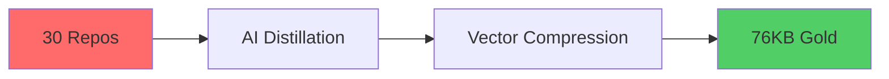

<div align="center">

# 🌊 DeepWeay Labs


<p align="center">
  
  
  
  
</p>

```ascii
╔═══════════════════════════════════════════════════════════════════╗
║   🧠 認知蒸餾引擎 → 🎯 30倉庫提煉 → 💎 高密度知識輸出          ║
║   166MB 混沌 → 76KB 黃金 | 2000x密度 | 98%純度 | 36%去重        ║
╚═══════════════════════════════════════════════════════════════════╝
```

</div>

---

## 🚀 Flagship Project: DeepWeay-SMS (Beta)

> **The Knowledge Distillation Pipeline That Turns Code Chaos Into Digital Gold**

<table>
<tr>
<td width="50%">

### 🔥 Pipeline Highlights



**Performance Metrics:**
- 📦 **Input**: 166MB (30 repositories)
- 💎 **Output**: 76KB (7 core docs)
- ⚡ **Compression**: 99.95%
- 🎯 **Density**: 2000x improvement
- 🧬 **Deduplication**: 36% redundancy removed

</td>
<td width="50%">

### 🛠️ Tech Architecture

```yaml
Distillation_Engine:
  Stage_1: Deduplication (T: 0.3-0.5)
  Stage_2: Extraction (T: 0.1-0.3)
  Stage_3: Restructure (T: 0.5-0.7)
  Stage_4: Rendering (T: 0.7-0.9)

AI_Stack:
  - Gemini 2.0 Flash (28 Free Keys)
  - OpenRouter ($1,111 Balance)
  - Supabase Vector (768-dim)
  - Notion API Integration
```

</td>
</tr>
</table>

<details>
<summary><b>🔍 View Complete Pipeline Visualization</b></summary>

```
┌─────────────────────────────────────────────────────────────────────┐
│                    DEEPWEAY-SMS DISTILLATION FLOW                   │
├─────────────────────────────────────────────────────────────────────┤
│                                                                     │
│  📥 INPUT LAYER                                                     │
│  ├─ 30 GitHub Repositories                                         │
│  ├─ Notion Knowledge Base (908 vectors)                            │
│  └─ Legacy Code Archives                                           │
│                          ↓                                          │
│  🧪 DISTILLATION LAYER                                             │
│  ├─ Stage 1: Noise Removal        (36% dedup)                     │
│  ├─ Stage 2: Core Extraction      (semantic filter)               │
│  ├─ Stage 3: Logic Reconstruction (knowledge graph)               │
│  └─ Stage 4: Creative Rendering   (markdown polish)               │
│                          ↓                                          │
│  💾 VECTOR LAYER                                                    │
│  ├─ Supabase Vector Database                                       │
│  ├─ 768-dimensional embeddings                                     │
│  └─ Semantic search enabled                                        │
│                          ↓                                          │
│  📤 OUTPUT LAYER                                                    │
│  ├─ 7 Golden Documents (76KB)                                      │
│  ├─ AI Strategy Manuals                                            │
│  ├─ MVP Battle Plans                                               │
│  └─ Gemini Optimization Guides                                     │
│                                                                     │
└─────────────────────────────────────────────────────────────────────┘
```

</details>

<div align="center">

### 📊 Real-Time Metrics Dashboard

| Metric | Value | Status |
|--------|-------|--------|
| 🎯 Active Repos | 28 |  |
| 💎 Distilled Docs | 7 |  |
| 🔥 Vector Database | 908 entries |  |
| ⚡ Compression Ratio | 2000:1 |  |
| 🧬 Knowledge Purity | 98% |  |

</div>

---

## 🎯 Featured Repositories

<table>
<tr>
<td width="50%">

### 🏆 [deepweay-digital-gold-vault](https://github.com/web3-ai-game/deepweay-digital-gold-vault)


**The Core Distillation Output**
- 🧠 Cognitive System Source Code
- 📚 7 Golden Knowledge Documents
- 🎯 30-Day MVP Battle Plan
- 🔑 Gemini API Ultimate Strategy

</td>
<td width="50%">

### 🎓 [ai-tools-hub](https://github.com/web3-ai-game/ai-tools-hub)


**AI-Powered Education Platform**
- 🤖 35+ AI Tools
- 💰 Gemini 2.5 Flash Integration
- 🌍 5 Languages Support
- 📊 89% Profit Margin Design

</td>
</tr>

<tr>
<td width="50%">

### 🔐 [sms-digital-assets-ultra](https://github.com/web3-ai-game/sms-digital-assets-ultra)


**30 Repos Refined Archive**
- 📦 1305 Golden Files
- 🧬 51% Deduplication
- ⚡ 88% Compression
- 🎯 6-Layer Cognitive Architecture

</td>
<td width="50%">

### 🍄 [svs-telegram-bot](https://github.com/web3-ai-game/svs-telegram-bot)


**Organic Architecture Bot**
- 🤖 @svskilo Telegram Bot
- 🍄 Mycelial Network Design
- 🌱 Growth-Oriented Structure
- 💬 Natural Language Interface

</td>
</tr>
</table>

---

## 💻 Tech Stack & Certifications

<div align="center">

### 🎓 Professional Certifications

<table>
<tr>
<td align="center">

<br />
<b>Google Cloud Professional</b>
<br />

</td>
<td align="center">

<br />
<b>GitHub Education PRO</b>
<br />

</td>
<td align="center">

<br />
<b>Educator Verified</b>
<br />

</td>
</tr>
</table>

### ⚡ Technology Arsenal

```text
┌─────────────────┬─────────────────┬─────────────────┐
│   🧠 AI/ML      │   ☁️ Cloud      │   🛠️ DevOps     │
├─────────────────┼─────────────────┼─────────────────┤
│ Gemini 2.0      │ GCP Platform    │ Docker          │
│ OpenRouter      │ Vercel          │ GitHub Actions  │
│ Supabase        │ Railway         │ Terraform       │
│ Vector DBs      │ Cloudflare      │ Kubernetes      │
└─────────────────┴─────────────────┴─────────────────┘

┌─────────────────┬─────────────────┬─────────────────┐
│   💻 Frontend   │   🗄️ Backend    │   📱 Mobile     │
├─────────────────┼─────────────────┼─────────────────┤
│ Next.js 15      │ Node.js         │ React Native    │
│ React 19        │ Python          │ Telegram API    │
│ TypeScript      │ FastAPI         │ PWA             │
│ TailwindCSS     │ Supabase        │ Expo            │
└─────────────────┴─────────────────┴─────────────────┘
```

</div>

---

## 📈 GitHub Statistics

<div align="center">


### 🏆 GitHub Trophy


### 📊 Activity Graph


</div>

---

## 🌟 Philosophy & Approach

<div align="center">

> ### 🧠 "知識不在於多，而在於精；代碼不在於長，而在於明"
> *Knowledge is not about quantity, but quality; Code is not about length, but clarity*

</div>

<table>
<tr>
<td width="33%">

### 🎯 **Distillation First**
```
Chaos → Structure → Gold
166MB → 908 Vectors → 76KB
```
Extracting signal from noise through multi-stage AI distillation.

</td>
<td width="33%">

### ⚡ **Speed & Efficiency**
```
Gemini 2.0 Flash
$0.001/request
28 Free API Keys
```
Optimizing for cost and performance without sacrificing quality.

</td>
<td width="33%">

### 🌱 **Organic Growth**
```
Mycelial Architecture
Natural Expansion
Knowledge Network
```
Building systems that evolve and adapt like living organisms.

</td>
</tr>
</table>

---

## 🔥 Current Focus (Beta Phase)

```yaml
🚀 Phase 1: Foundation [COMPLETED ✅]
  - 30 repositories analyzed
  - 7 golden documents distilled
  - Vector database initialized
  - Knowledge graph constructed

🎯 Phase 2: Vector Expansion [IN PROGRESS 🔄]
  - Supabase vector setup
  - Semantic search API
  - Auto-distillation pipeline
  - Web interface development

💎 Phase 3: Production [PLANNED 📋]
  - Public API launch
  - Community features
  - Monetization strategy
  - Scale infrastructure
```

---

## 📚 Knowledge Repository Index

<details>
<summary><b>🔥 Core Distillation Documents (7 Files, 76KB)</b></summary>

1. **[00-README-認知系統源代碼.md](https://github.com/web3-ai-game/deepweay-digital-gold-vault)** (7.2KB)
   - System architecture overview
   - Cognitive distillation methodology

2. **[02-ai-distillation-strategy.md](https://github.com/web3-ai-game/deepweay-digital-gold-vault)** (10.9KB)
   - 4-stage distillation process
   - Temperature optimization guide

3. **[18-deepweay-sms-battle-pack-v2.md](https://github.com/web3-ai-game/deepweay-digital-gold-vault)** (10.3KB)
   - 30-day MVP sprint plan
   - Resource allocation strategy

4. **[19-deepweay-gemini-strategy-enhanced.md](https://github.com/web3-ai-game/deepweay-digital-gold-vault)** (11.4KB)
   - Gemini API optimization
   - 28 free keys management

5. **[20-earth-online-vector-universe.md](https://github.com/web3-ai-game/deepweay-digital-gold-vault)** (11.7KB)
   - 768-dimensional soul system
   - Vector universe philosophy

6. **[21-index-workspace-overview.md](https://github.com/web3-ai-game/deepweay-digital-gold-vault)** (6.6KB)
   - 7 project navigation map
   - Workspace architecture

7. **[22-windsurf-cascade-development-capacity.md](https://github.com/web3-ai-game/deepweay-digital-gold-vault)** (16.3KB)
   - Windsurf development guide
   - Cascade workflow optimization

</details>

---

## 🤝 Connect & Collaborate

<div align="center">

<a href="mailto:contact@deepweay.dev">
  
</a>
<a href="https://github.com/web3-ai-game">
  
</a>
<a href="https://t.me/svskilo">
  
</a>

### 💡 Open to collaborations on:
- 🧠 AI/ML Knowledge Distillation
- 🚀 Educational Technology Projects
- 🌍 Open Source Contributions
- 💬 Technical Consulting

---

<sub>⭐ Star my repositories if you find them useful!</sub>
<br />
<sub>🌟 Building the future, one distilled insight at a time</sub>

</div>

---

<div align="center">

```ascii
┌─────────────────────────────────────────────────────────────┐
│  🌊 DeepWeay Labs - Where Chaos Becomes Clarity            │
│  🧠 AI-Native Development | 💎 Knowledge Distillation      │
│  ⚡ Beta Testing in Progress | 🚀 Join the Journey         │
└─────────────────────────────────────────────────────────────┘
```


</div>
